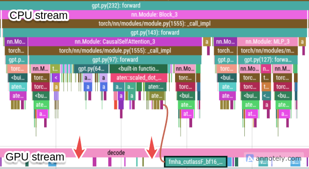

# gpt-benchmark

Making small indri as fast as possible

This is an effort at making small models (<1B params) run as fast as possible!
(Running models at the highest throughput possible and lowest time to fist token for the batch size of 1)

## Baseline numbers

### 4090

Let's first evaluate what speed do we get for small models on consumer grade GPUs. For this test, I am using Nvidia RTX 4090 as the GPU and gpt2 (smallest size) as the model with `bfloat16` as the data type. For simplicity, I am selecting batchsize as 1. We can extend the approach for different batch sizes. We will examine two frameworks - vLLM and HuggingFace. The model run via HuggingFace is first compiled using `torch.compile`. We will examine two metrics:

1. TTFT (time to first token): We will keep the output tokens fixed and vary the number of input tokens given to the model. Lower the better.
2. Throughput (Tokens/s): We will keep the input tokens fixed and vary output tokens generated by the model. Higher the better.

Figure 1: (Left) TTFT vs # of input tokens, (Right) Decoding throughput vs # of output tokens

A couple of observations from the benchmark run:

1. The TTFT for huggingface is unusually lower than vLLM for small number of input tokens, but a general observation is that vLLM's TTFT is much more stable and predictable than HuggingFace.
2. The decoding throughput of vLLM is ~2x of HuggingFace. This clearly shows the effor that vLLM team has put into optimizing inference for language models.

## Why is it slow?

Let's first figure out if the numbers we got are the best numbers we can get. While running any model the GPU is doing two things:

1. Computations e.g. matrix multiplacations, exponentiation, etc.. The latency of these computations are bound by floating point operations (FLOPs) that the cores of the GPU can perform.
2. Transferring model weights to and fro from the global memory of the GPU (HBM) to L1 cache where the cores can access them. The latency of this movement is bound by the memory bandwidth of the GPU.

The end to end latency is bound by whichever is slower from the two ($Latency_{compute}$, $Latency_{memory}$)

There are two phases in autoregressive decoding:

1. Prefill phase: Where the prompt in processed and the first token is generated. This phase is responsible for time to first token.
2. Decoding phase: Where remaining tokens are generated autoregressively. This phase is reponsible for throughput (output tokens/s).

Let's calculate theoretical latencies on Nvidia 4090 for GPT2 for both of these phases separately.

### Prefill phase

For prefill phase, GPT2 consumes: $\approx 22.4 GFlOPSs$ for a context length of 128 tokens [^A1]. Nvidia 4090 has 84 TFlops of compute for FP16. Assuming 100% utilization, we get:

$$Latency_{compute} = 22.4 GFLOPS/84 TFLOPS = 2.6 * 10^{-4}s$$

Similarly, assuming FP16 weights, the model size that the GPU would need to transfer would be $2*137*10^6 \approx 274 MB$. The memory bandwidth of Nvidia 4090 is $1008 GB/s$. We get:

$$Latency_{memory} = 274 MB/1008 (GB/s) = 2.7 * 10^{-4}s$$

The prefill phase of the model will be bound by $min(Latency_{compute}, Latency_{memory})$ which for this case comes to be memory bound. Theoretically, we should get the latency of 0.27 ms for prefill phase (i.e. TTFT). In the above graphs, we see a latency of approximately 10x.

### Decoding phase

For decoding phase, considering a single token decoding, GPT2 would consume $\approx 0.24 GFLOPS$. Again, assuming 100% utilization of FP16 cores on Nvidia 4090, we get

$$Latency_{compute} = 0.24 GFLOPS/84 TFLOPS = 2.9 * 10^{-6}s$$

The $Latency_{memory}$ would be same as prefill phase, the same model weights are required to decode a single token. The decode phase of the model will again be memory bound. Theoretically, inter-token latency should be 0.27 ms. This is equivalent to ~3700 tok/s (~4x of vLLM)

The theoretical limits are extremely high, but we fail to see those numbers during actual runs. What can be the reason for that?

## Special case for smaller models

According to the calculations, the model is memory bound. But we have not yet taken into account the overhead of running these models. The overhead of Python and PyTroch. For larger models, the overhead of the framework is mostly hidden because of the time it takes to transfer the weights or do to the actual computations is higher than the overhead time. But for smaller models, this overhead becomes a bottleneck in the latency.

For example, here is the result of profiling gpt2 from HuggingFace:

Figure 2: GPT2 (without CUDA graphs) on torch profiler

Even after using `torch.compile`, there are clear gaps in the GPU stream, where the GPU is waiting for instructions from CPU. This is the idle time on GPU where it is neither perfoming any computation nor transferring weights. This happens because the earlier computations and transfers of the model were so fast that they got completed before the CPU had the time to issue a new instruction to the GPU. This strongly indicates that we are in the overhead bound region.

How do go about getting rid of overhead bound? There are a few possibilities:

1. Use a language or framework which has lower overhead (e.g. C++ rather than Python). This comes with a lot of challenges. One has to learn a new language and framework and reproduce the same model from scratch in another language and framework.
2. Trace the computation and figure out how one can send instructions from CPU at a faster rate. This is possible by using `torch.compile` and using CUDA graphs. Let's discuss this approach in the next section.

## Overhead bound

CUDA graphs is a way to record all the operations of any series of computations ahead of time, and send it as one big computational graph to the GPU. Everytime the GPU gets a new request on the same model, it can just replay the same instruction set (graph). This avoids the CPU from sending a series of instructions again and again to the GPU and saves time on the overhead. This is a perfect usecase for the decoding phase, where the transformer model is essentially performing the same set of operations on different tokens multiple times.

However, there are a few constraints[^A2] that can prevent us from building this computational graph ahead of time in PyTroch:

1. Dynamic sizes of intermediate tensors
2. Any synchronization between CPU and GPU

Both of these constraints apply if we are using directly using HuggingFace transformers. How?

1. KV cache: By default, the KV cache initialized by HuggingFace is dynamic in nature. It creates a new tensor everytime a new token is decoded to save in the KV cache
2. Sampling: During sampling of tokens, a call to `torch.multinomial` is made [^A3]. This call forces a synchronization between CPU and GPU [^A4] which prevents PyTorch from building a static ahead of tine CUDA graph.

This repo avoids the above two issues, and re-implements the GPT archiecture taking reference from NanoGPT [^A5]. It allocates all the memory needed for KV cache ahead of tine so that no extra memory is allocated during runtime and it avoids the call to `torch.multinomial` by implementing a custom sampling fuction [here](https://github.com/romitjain/indri-benchmark/blob/master/src/sampling.py#L32-L33). This is borrowed from gpt-fast [^A6] repo.

After addressing both the issues, we get the folling profile of running GPT2

Figure 3: GPT2 (with CUDA graph enabled) on torch profiler

Notice how the GPU stream is always executing an instruction. This means that the GPU is optimally occupied and has to never wait on CPU to send it an instruction.

Here are the results of comparing it side by side with vLLM and HuggingFace

Figure 4: (Left) TTFT vs # of input tokens, (Right) Decoding throughput vs # of output tokens

One downside of static KV cache is that a large chunk of GPU memory is blocked ahead of time. This can lead to launching attention kernels which take more time than the one that used dynamic allocation of KV cache.

## Other optimizations

Now that overhead is mostly removed, what are other optimization that can be done to run this small model even faster? There are two lines of improvements that can be done:

1. Kernel fusion
2. Reducing memory footprint

### [Kernel fusion] Sampling

If we look at the profiler again, we can notice multiple kernel launches for sampling. There are 3 steps in sampling:

1. Temperature scaling
2. Top K logit selection
3. Softmax
4. Sampling of probability

But, the actual number of kernel launches are more than 4 since PyTorch implements top-k with multiple different kernels. This can cause the data to be read multiple times and hence reduce throughput. If we write a single kernel that does complete sampling, it would enable us to speed up the sampling step (which is essentially applied at every step).

### [Reducing memory footprint] Quantization

Now that all the overhead bound is removed, we can work on reducing memory bandwidth latency too. By quantizing models to 4bit or 8bit, the model performance does not degrade by a lot, but reduces the time it takes to move the model weights from HBM to L1 cache. This reduction in time can lead to better throughput.

### [Reducing memory footprint] Attenion kernel

Another optimization is instead of using Static KV cache, we can implement [PagedAttention](https://blog.vllm.ai/2023/06/20/vllm.html) that can scale down the runtime of attention kernel compared to static KV cache.

## References

[^A1]: You can use `torch.flop_counter` to get the exact FLOPs of GPT2. The one estimated here is close enough to the actual number.

[^A2]: [CUDA graph constraints](https://pytorch.org/docs/main/notes/cuda.html#constraints)

[^A3]: [HuggingFace torch.multinomial call](https://github.com/huggingface/transformers/blob/main/src/transformers/generation/utils.py#L3299)

[^A4]: [PyTorch multinomial sampling issue](https://github.com/pytorch/pytorch/issues/108968)

[^A5]: [NanoGPT](https://github.com/karpathy/nanoGPT)

[^A6]: [gpt-fast](https://github.com/pytorch-labs/gpt-fast)
